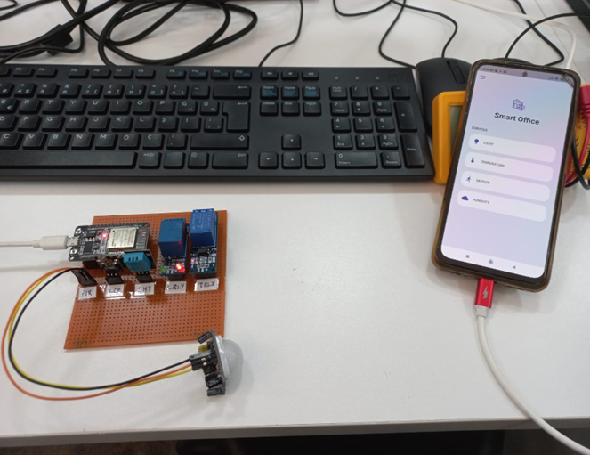
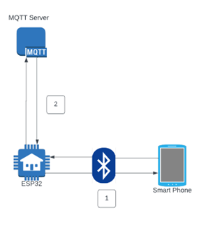
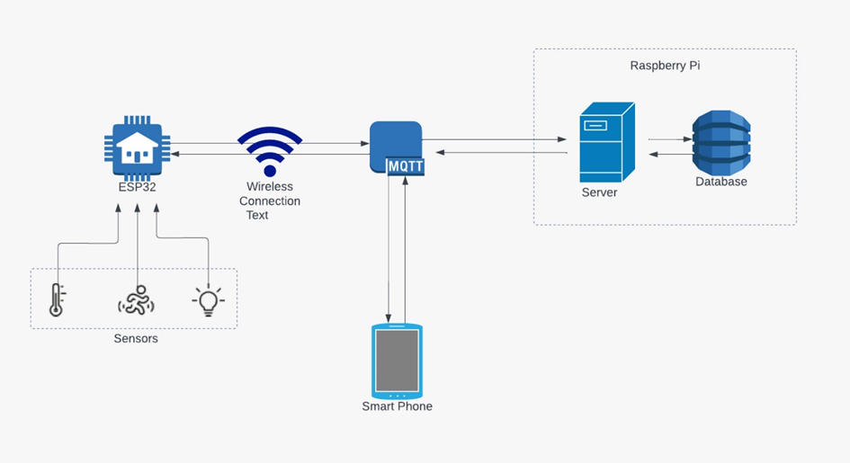
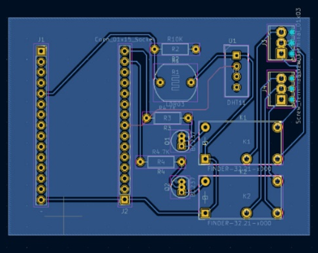
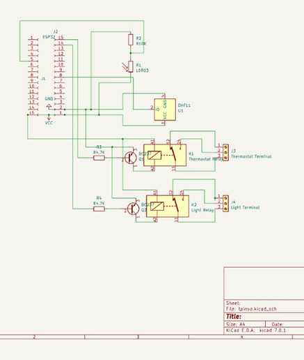

# Smart Office Project

## Overview

The **Smart Office Project** aims to create an energy-efficient and comfortable work environment for SMEs, workplaces, and laboratories. It monitors temperature, lighting, and inactivity, allowing remote management via a mobile app. The project seeks to reduce energy consumption and improve efficiency at a low cost.

## Project Objective

The primary goal is to implement a smart system that:

- Monitor environmental parameters.
- Transmit and back up data to a central server.
- Enable remote control via a mobile application.
- Automate responses to environmental changes to reduce energy consumption.
- Provide a cost-effective solution for workplace efficiency.

## Technical Details

### Components

- **DHT Temperature and Humidity Sensor**: Measures ambient temperature and humidity levels.
- **LDR Light Sensor**: Monitors ambient light levels.
- **PIR Motion Sensor**: Detects motion within the environment.
- **Relay Modules**: Controls circuits to manage connected devices.
- **ESP32 Microcontroller**: Operates the sensors and connects to the internet.
- **Raspberry Pi 3**: Functions as an MQTT server and database, handling data from sensors and communicating with the mobile application.

### Methodology

1. **Data Collection**: Sensors connected to the ESP32 microcontroller gather data on temperature, humidity, light, and motion.
2. **Data Transmission**: Collected data is encrypted and sent via Wi-Fi to an MQTT server hosted on the Raspberry Pi using the MQTT protocol.
3. **Data Processing**: The server processes the data, compares it to threshold values set in the mobile application, and issues commands to control connected devices.
4. **User Interface**: The mobile application, developed with the Flutter framework, allows users to monitor and manage environmental parameters remotely.

### Security

- **Unique IDs**: Communication between the ESP32 and the MQTT server is secured using unique 16-character hexadecimal IDs generated by the ESP32.
- **Bluetooth Configuration**: Initial setup involves Bluetooth communication between the mobile app and the ESP32 to configure Wi-Fi credentials and server details.
- **Secure Communication**: Post-setup, all communication is handled securely over Wi-Fi with unique IDs ensuring safe data transmission.

## Results

- **Mobile Application**: A Flutter-based application enabling easy remote management.
- **MQTT Server**: A robust server setup on Raspberry Pi to handle data and commands.
- **Sensor Network**: An efficient sensor network for real-time monitoring of environmental parameters.

&nbsp;

## Future Improvements

### Phase Two: Artificial Intelligence

- **AI Integration**: Implementing AI to analyze employee habits and automatically adjust environmental settings for optimal comfort and efficiency.
- **Enhanced Automation**: Enabling the system to make autonomous decisions based on predictive analytics, such as adjusting lighting or temperature based on usage patterns.

## Conclusion

The Smart Office Project successfully demonstrates a cost-effective and efficient approach to creating a smart office environment. The ongoing development and future integration of AI will further enhance its capabilities, making it a comprehensive solution for modern workplaces.

## References

1. Yuan, M., Updated 8 December 2021, Published 11 May 2017, [Getting to know MQTT](https://developer.ibm.com/articles/iot-mqtt-why-good-for-iot/).
2. [DHT11 Humidity & Temperature Sensor Datasheet](https://www.mouser.com/datasheet/2/758/DHT11-Technical-Data-Sheet-Translated-Version-1143054.pdf).
3. [LDR Datasheet](https://components101.com/sites/default/files/component_datasheet/LDR%20Datasheet.pdf).
4. [HC-SR501 PIR Motion Detector Datasheet](https://components101.com/sites/default/files/component_datasheet/HC%20SR501%20PIR%20Sensor%20Datasheet.pdf).
5. [ESP-IDF Programming Guide](https://docs.espressif.com/projects/esp-idf/en/latest/esp32/index.html).
6. [Flutter Documentation](https://pub.dev/documentation).

## Acknowledgments

We extend our gratitude to Yaşar BURÇAK, Counseling Course Teacher at İzmir Kız High School. Special thanks to Prof. Dr. Yusuf Murat ERTEN and Prof. Dr. Yaşar Güneri ŞAHİN of İzmir University of Economics for their support and contributions.

## Contributors

- Köksal Berkay DENKTAŞ
- Murat IŞIK
- Göktuğ Furkan ARICA
- Kadir Berktuğ CANTÜRK
- Deniz DOĞAN

## License

This project is licensed under the GNU GENERAL PUBLIC LICENSE - see the LICENSE file for details.
